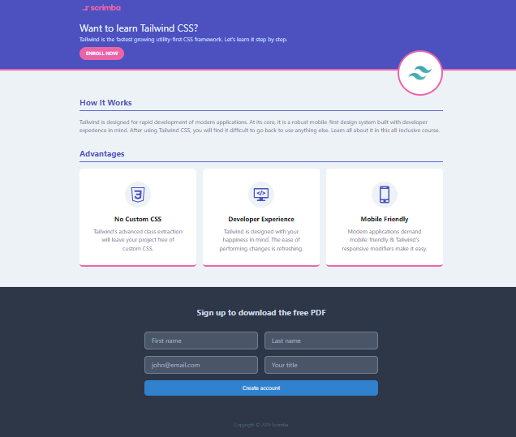

## Table of contents

- [Overview](#overview)
  - [Description](#description)
- [Projects](#projects)
  - [1-Employee Card App](#employee-card)
  - [2-Landing Page](#landing-page)

  
  
  ## Overview
  ### Description
  I completed 1 projects(also there is one more project, i am working on it) of Tailwind CSS course on [Scrimba](https://scrimba.com/learn/tailwind/employee-card-challenge-cD7GPvfW). I mastered Tailwind CSS in these projects. 
  You can see the visual representations of the each app below.
  
  ## Projects
  ### 1-Employee Card App
  ### Visulation of the App 

    
    
  ### 2-Landing Page
  ### Visulation of the App 

    
